# ios-contact-manager-ui 

# 📱 프로젝트 소개

- **연락처의 추가 및 삭제를 지원하는 연락처 앱입니다.**

# 🧑‍💻 프로젝트 팀원
|  |  |  |
| --- | --- | --- |
| Github | [@shilm0](https://github.com/shlim0) | [@KimRoks](https://github.com/KimRoks) |
| NickName | 쫑 | 록스 |

# 📖 요구 사항

- iOS 16.0 +

# 📺 프로젝트 실행 영상

https://github.com/shlim0/ios-contact-manager-ui/assets/46235301/a6d38d66-2fe5-4fdd-b8cf-c6217844acbe

# 🖥️ 프로젝트 실행 화면

- **연락처 목록을 표시합니다.**
  
    

- **연락처 추가를 지원합니다.**
    - API(JSON)를 통한 연락처 추가 또한 지원합니다.
      
    

- **잘못된 입력에 대한 Alert를 지원합니다.**

    

- **이름 및 전화번호를 통한 검색이 지원합니다.**
  
    

- **연락처 삭제를 지원합니다.**

    

# 🖇️ UML

```mermaid
classDiagram
class ContactDTO {
+name: String << read-only >>
+age: String << read-only >>
+phoneNumber: String << read-only >>
}

class JSONCodable {
<< protocol >>
+decodeJSON(): [ContactDTO]?
}

class DataSendable {
<< protocol >>
+send(data: ContactDTO)
}

class UITableViewDataSource {
<< protocol >>
+tableView(_ tableView: UITableView, numberOfRowsInSection section: Int) : Int
+tableView(_ tableView: UITableView, cellForRowAt indexPath: IndexPath): UITableViewCell
+tableView(_ tableView: UITableView, commit editingStyle: UITableViewCell.EditingStyle, forRowAt indexPath: IndexPath)
}

class JSONCodable {
<< protocol >>
}

class UITableViewDelegate {
<< protocol >>
}

class UISearchBarDelegate {
<< protocol >>
+searchBar(_ searchBar: UISearchBar, textDidChange searchText: String)
}

class UIAlertController {
<< extension >>
+configureAlertController(title: String, message: String, defaultAction: String, destructiveAction: String, viewController: UIViewController)
+configureAlertAction(of: UIAlertController, defaultAction: String)
+configureAlertAction(of: UIAlertController, defaultAction: String, destructiveAction: String, viewController: UIViewController)
+configureDestructiveAlertAction(title: String, viewController: UIViewController): UIAlertAction
+configureDefaultAlertAction(title: String): UIAlertAction
}

class String {
<< extension >>
+formattingPhoneNumber(divider: Character): String
}

class CONTACT_VIEW_CONTROLLER {
-@IBOutlet tableView: UITableView
-@IBOutlet searchBar: UISearchBar
-@IBOutlet contactDTOs: [ContactDTO]
-@IBOutlet filteredContact: [ContactDTO]

+viewDidLoad()
-touchUpAddButton(sender: Any) << @available(iOS 16.0, *) >>
-loadJson()
-loadDelegate()
}

class NEW_CONTACT_VIEW_CONTROLLER {
<< @available(iOS 16.0, *) >>
-@IBOutlet cancelButton: UIBarButtonItem
-@IBOutlet nameTextField: UITextField
-@IBOutlet ageTextField: UITextField
-@IBOutlet phoneNumberTextField: UITextField
+delegate: DataSendable

+viewDidLoad()
-phoneNumberTextFieldEditingChanged(sender: UITextField)
-touchUpSaveButton(sender: Any)
-touchUpCancelButton(sender: UIBarButtonItem)
}

class DecodingErrors {
<< enumeration >>
invaildPath
invaildData
invaildDecoding
}

class CheckContactErrors {
<< enumeration >>
invalidName
invaildAge
invalidPhoneNumber
unknown
}

class Validation {
<< @available(iOS 16.0, *) struct >>
+check(name: String?): String
+check(age: String?): String
+check(phoneNumber: String?): String
}

class CUSTOM_TABLE_VIEW_CELL {
-@IBOutlet nameAge: UILabel
-@IBOutlet phoneNumber: UILabel
+cellName << read-only >>
+customCellIdentifier << read-only >>

+awakeFromNib()
+setSelected(_ selected: Bool, animated: Bool)
+configure(with contact: ContactDTO)
}

JSONCodable ..> ContactDTO
JSONCodable --> DecodingErrors: throws
DataSendable ..|> AnyObject
DataSendable ..> ContactDTO
ContactViewController --|> UIViewController
ContactViewController ..|> DataSendable
ContactViewController ..|> JSONCodable
ContactViewController --o UIAlertController
ContactViewController --> String
ContactViewController --o ContactDTO
ContactViewController ..|> DataSendable
ContactViewController ..|> JSONCodable
ContactViewController ..|> UITableViewDataSource
ContactViewController ..|> UITableViewDelegate
ContactViewController ..|> UISearchBarDelegate
ContactViewController ..> Validation
Validation --> CheckContactErrors: throws
NewContactViewController --|> UIViewController
NewContactViewController --o UIAlertController
CustomTableViewCell --|> UITableViewCell
CustomTableViewCell --o ContactDTO
```



# ⚙️ 프로젝트 구조


- Utilities
    - `Validation`: `struct Validation`에 연락처 정보를 검사하는 함수를 둔 파일입니다.
- protocols
    - `JSONCodable`: `.json` 파일을 decoding 하는 코드를 따로 분리하고 재사용 하기 위해 생성한 protocol 입니다.
    - `DataSendable`: `NewContactViewController`에서 `ContactViewController`로 데이터를 delegate 방식으로 전달하기 위해 생성한 protocol 입니다.
- Extensions
    - `JSONCodable+Extension`: `.json` 파일을 decoding 하는 코드를 따로 분리하기 위해 생성한 extension 입니다. `JSONCodable`을 채택하는 class에서 따로 구현할 필요 없이 하기 위한 extension 입니다.
    - `String+Extension`: 사용자로 부터 전화번호를 입력받을 때, 하이픈(`-`)을 추가하기 위해 생성한 extension 입니다.
    - `AlertController+Extension`: `ContactViewController`와 `NewContactViewController`에서 기존 alertController를 API 처럼 편하게 사용하기 위한 extension 입니다.
- Models
    - `ContactJSON`: 연락처 정보가 있는 dummy `.json` 파일입니다.
    - `ContactDTO`: decoding 된`.json` 파일을 받을 모델입니다.
- Controllers
    - `ContactViewController`: 첫 번째 화면을 나타내는 VC 입니다. 연락처 정보가 없는 경우, cell을 불러오지 않습니다.
    - `NewContactViewController`: 사용자가 `ContactViewController`에서 연락처를 추가하는 버튼을 터치했을 경우, 나타나는 VC 입니다. 사용자로부터 이름, 나이, 연락처를 입력받을 수 있습니다. 이에 대한 유효성 검사를 하며, 이는 저장 또는 취소 될 수 있습니다.
- Views
    - `CustomTableViewCell`: TableView를 보여줄 Custom Cell입니다.
- Errors
    - `DecodingErrors`: `JSONCodable+Extension`에서 `.json` 파일이 decoding 되지 않는 error를 정의한 enum 입니다.
    - `CheckContactErrors`: `NewContactViewController`에서 사용자로부터 입력 받은 이름, 나이, 연락처가 유효하지 않는 경우에 대한 error를 정의한 enum 입니다.
- ContactManagerTests
    - `ContactManagerTests`: `Validation`을 테스트하는 파일입니다.

# ⚠️ Trouble Shooting

## . AlertController

- `UIAlertController`를 `extension`하여 역할별로 `methods`를 구분하고 재사용성을 높이고자 했습니다.즉,`AlertController+Extension.swift`로 기능을 분리하였습니다.

## **기존 코드**


- 기능을 분리하기 위해 초기 생각한 컨셉입니다. 1번, 2번, 3번으로 구분하여 각 기능을 분리하려 했습니다.
- 기존 작성된 alert을 만드는 메서드입니다.
    
    해당 메서드는 1. `UIAlertController`를 정의하며, 2. action을 정의하고, 3. action을 추가하며, 4. 추가 화면에 `present()`하는 등 많은 일을 하나의 메서드에서 수행했습니다.
    
    이를 SOLID 중, S(`단일 책임 원칙`)를 따르도록 각 역할을 분리하였습니다.
    

## 변경 후 코드

```swift
// AlertController+Extension.swift
extension UIAlertController {

// message와 두번째 alert action은 선택 사항으로 두었습니다.
// 두번째 alert action를 .destructive 둔 이유는 UX 측면에서 alert이 뜨면 "예" 또는 "아니오"(또는 "확인" 또는 "취소")가 출력되는 경우를 종종 보았습니다. 이런 경우를 대비하였습니다.
  func configureAlertController(title: String, message: String?, defaultAction: String, destructiveAction: String?, viewController: UIViewController) {
      let alertController = UIAlertController(title: title,
                                              message: message,
                                              preferredStyle: .alert)
      
      if let destructiveAction = destructiveAction {
          configureAlertAction(of: alertController, defaultAction, destructiveAction, viewController)
          viewController.present(alertController, animated: true)
      } else {
          configureAlertAction(of: alertController, defaultAction)
          viewController.present(alertController, animated: true)
      }
  }
  
// alert action이 하나인 경우를 처리합니다.
  func configureAlertAction(of alertController: UIAlertController, _ defaultAction: String) {
      alertController.addAction(configureDefaultAlertAction(title: defaultAction))
  }
  
// alert action이 두개인 경우를 처리합니다.
  func configureAlertAction(of alertController: UIAlertController, _ defaultAction: String, _ destructiveAction: String, _ viewController: UIViewController) {
      alertController.addAction(configureDefaultAlertAction(title: defaultAction))
      alertController.addAction(configureDestructiveAlertAction(title: destructiveAction, viewController))
  }

// .destructive alert action을 처리합니다.
  func configureDestructiveAlertAction(title: String, _ viewController: UIViewController) -> UIAlertAction {
      let destructiveAlertAction = UIAlertAction(title: title, style: .destructive, handler: { _ in
          viewController.dismiss(animated: true)
      })
      
      return destructiveAlertAction
  }
// .default alert action을 처리합니다.
  func configureDefaultAlertAction(title: String) -> UIAlertAction {
      let defaultAlertAction = UIAlertAction(title: title, style: .default, handler: nil)
      
      return defaultAlertAction
  }
}
```

- 사용법
    
    ```swift
    //Alert 생성 예시
    alertController.configureAlertController(title: "데이터 불러오기 실패",
    		                                     message: nil,
                                             defaultAction: "예",
                                             destructiveAction: nil,
                                             viewController: self)
    ```
    
    - 결과적으로 Alert를 반복적으로 작성하던 것을 줄이고, 메서드에서 원하는 기능만을 담은 Alert를 커스텀하여 생성할 수 있도록 변경되었습니다.
